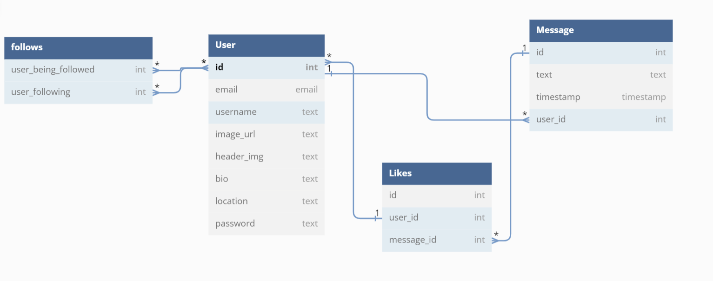

<h1 align="center">
  Twitter-Clone
</h1>
<p align="center">
  
  
  
  
</p>

## Project Demo


## Description
Twitter-clone is a full stack web application built using the Python - Flask - PostgreSQL stack. The idea was not to make the app look pretty but to get the functionality right in a simplistic approach. The database has four tables and the tables are linked as below:



## Key Features

- Create accounts
- Authentication for login, logout users
- Search, Follow/Unfollow users
- Create/Delete messages
- Delete user account

## Getting Started

```python
# Install dependencies for server & client
pip install -r requirements.txt

# Create database and seed
createdb warbler
python seed.py

# Run server
flask run 

# Server runs on http://localhost:5000 
```